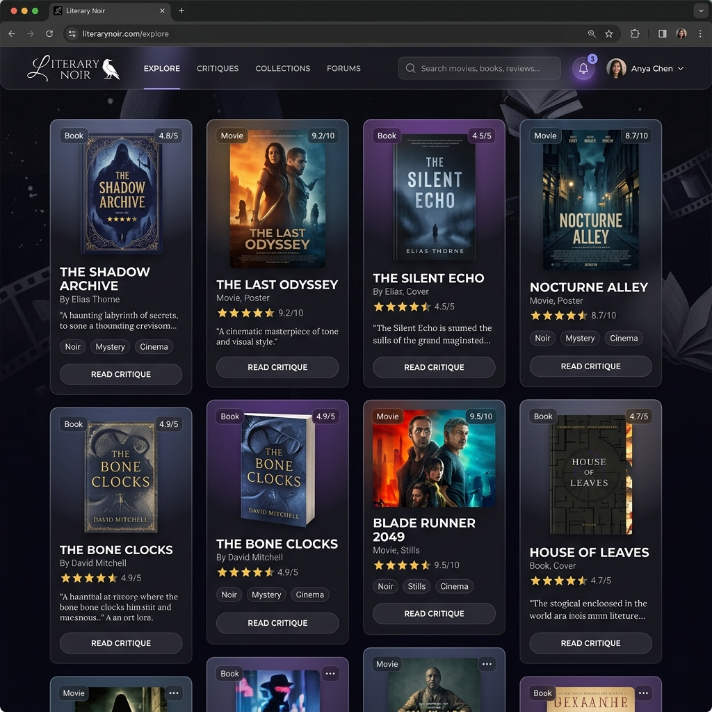

# 🖋️ Literary Noir: Cinema & Literature Critique Platform



Welcome to **Literary Noir**, a premium platform for sophisticated cinema and literature reviews. Designed with a sleek, modern aesthetic and advanced features, this application brings a deeply immersive reading and writing experience to critics and enthusiasts alike.

## ✨ Features

### 🎨 Stunning Premium Aesthetic
- **Glassmorphism UI**: Beautiful frosted-glass layers and dynamic backdrop blurs.
- **Micro-animations**: Smooth staggered list transitions and responsive hover effects.
- **Theme Engine**: Toggle between "Light", "Cinema" (Dark Mode), and "Literature" (Sepia/Cream) modes to match your reading environment.
- **Ambient Soundscapes**: Built-in audio player featuring relaxing rain sounds for focused reading and writing.

### ✍️ Powerful Editor
- **Rich Text Engine**: Powered by Tiptap, giving you total control over headers, quotes, formatting, and lists.
- **Typewriter Mode**: Authentic mechanical typewriter sound effects while drafting reviews for a tactile writing experience.
- **Seamless Saving**: Easy interface for creating and managing critiques.

### 🔔 Real-Time Interactivity
- **Live Notifications**: Full WebSocket architecture (Socket.io) delivers instant "toast" alerts and updates the bell badge the moment someone comments on your work.
- **Global Search (`Cmd+K` / `Ctrl+K`)**: Rapid, keyboard-driven search to discover reviews anywhere on the site.

### 🧠 Personalized Experience
- **Recommendation Engine**: The "For You" page curates reviews specifically tailored to your genre preferences and interaction history.
- **Investigation Board & Timeline**: View content through unique chronological timelines or node-based visual investigation boards.
- **Progressive Web App (PWA)**: Installable on desktop and mobile for offline access and native-like performance.

---

## 🛠️ Tech Stack

- **Framework:** Vue 3 (Composition API) + Vite
- **State Management:** Pinia
- **Styling:** Vanilla CSS (CSS Variables, Flexbox, CSS Grid)
- **Data Fetching:** `@tanstack/vue-query` for smart caching and background syncing
- **Rich Text:** Tiptap Vue 3
- **Real-time Engine:** Socket.io Client
- **Data Visualization:** `vis-network` (for the Investigation Board)
- **Deployment:** Netlify (via GitHub Actions CI/CD)

---

## 🚀 Local Development

We use Docker Compose to make spinning up the environment incredibly smooth!

### Prerequisites
- Node.js `v20+`
- Docker & Docker Compose (Optional, but recommended)

### Method 1: Using Docker Compose (Recommended)
You can run both the Frontend and the NestJS Backend simultaneously with hot-module reloading:
```bash
# In the root directory (c:\blogger):
docker compose up -d
```
The frontend will be available at `http://localhost:5173`.

### Method 2: Manual Start
```bash
npm install
npm run dev
```

---

## 🏗️ Building for Production

This app uses Vite for extremely fast, optimized production builds.
```bash
# Type check and build
npm run build

# Preview production bundle locally
npm run preview
```

## 🔄 CI/CD Pipeline

This project is configured with robust DevOps pipelines using **GitHub Actions**.
Every push to the `main` branch automatically:
1. Runs strict TypeScript type-checking (`vue-tsc -b`)
2. Builds the optimized production artifact
3. Deploys the result seamlessly to **Netlify**

*(Ensure `NETLIFY_AUTH_TOKEN` and `NETLIFY_SITE_ID` are configured in your repository secrets).*

---

*Built with passion for film, books, and beautiful code.*
